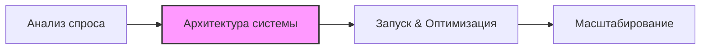

# Google Ads: Системный подход и кейсы

## HERO

**Google Ads как управляемая система спроса, а не хаотичный набор кампаний**

Проектирую прозрачные рекламные структуры, объединяя Search, Performance Max, Shopping и DSA в единую воронку. Моя цель — убрать "шум", изолировать интент и создать базу для масштабирования прибыли.

> [!TIP]
> **Мой подход**: Фокус на архитектуре аккаунта и приоритизации маржинальных направлений.

- **Смотреть кейсы ↓**
- **Запросить экспертный разбор аккаунта**

---

## МЕТОДОЛОГИЯ: КАК Я РАБОТАЮ

Сначала я фиксирую **карту спроса**: где находится горячий интент, где брендовое облако и какие кампании реально генерируют ценность.

1.  **Разбор**: Глубокий аудит текущей структуры.
2.  **Изоляция**: Отделение брендового спроса от категорийного.
3.  **Сборка**: Пересборка Search / PMax / Shopping / DSA в единую логику.
4.  **Фокус**: Поиск точечных зон роста без "раздувания" бюджета.

---

## ВЫБРАННЫЕ КЕЙСЫ

### 1. E-commerce: зоотовары
**Задача**: Трансформировать аккаунт в управляемую систему и усилить приоритетные сегменты.  
**Решение**: Внедрена сегментация по типам спроса и синхронизация Performance слоев.  
**Результат**: Прозрачная структура и фундамент для роста.

| 90 дней | Показы | Клики | Расход | Конверсии |
| :--- | :--- | :--- | :--- | :--- |
| **Результат** | 1.2 млн | 37 тыс. | ~€13.9k | 2 485 |

**Разбор решения**: [Открыть детальный кейс](./1_ecommerce_zootovary.md)

---

### 2. E-commerce: товары для гриля
**Задача**: Масштабировать ключевые категории при сохранении высокого ROAS.  
**Решение**: Категорийная декомпозиция каталога и запуск "умного" масштабирования через PMax.  
**Результат**: Захват доли рынка в приоритетных нишах.

| 90 дней | Показы | Клики | Расход | Value |
| :--- | :--- | :--- | :--- | :--- |
| **Результат** | 6.1 млн | 134 тыс. | ~€23.2k | ~€157.6k |

**Разбор решения**: [Открыть детальный кейс](./2_ecommerce_tovary_dlya_grilya.md)

---

### 3. B2B: логистика
**Задача**: Усилить поток качественных лидов и убрать информационный "шум".  
**Решение**: Изоляция брендового интента и вертикализация рекламных кампаний по услугам.  
**Результат**: Контролируемый поток B2B-обращений.

| 90 дней | Показы | Клики | Расход | Конверсии |
| :--- | :--- | :--- | :--- | :--- |
| **Результат** | 1.9 млн | 45 тыс. | ~€10.3k | 1 090 |

**Разбор решения**: [Открыть детальный кейс](./3_b2b_logistika.md)

---

### 4. E-commerce: электротовары
**Задача**: Повысить маржинальность за счет приоритизации товарных групп.  
**Решение**: Инвентарный аудит и внедрение скоринг-модели в PMax стратегии.  
**Результат**: Рост выручки в целевых категориях электроники.

| 90 дней | Показы | Клики | Расход | Value |
| :--- | :--- | :--- | :--- | :--- |
| **Результат** | 4.3 млн | 95.6 тыс. | ~€7.9k | ~€51.6k |

**Разбор решения**: [Открыть детальный кейс](./4_ecommerce_elektrotovary.md)

---

## ЧТО ВЫ ПОЛУЧИТЕ НА ВЫХОДЕ

- **Прозрачность**: Вы будете видеть, за что платите и как работает каждый евро.
- **Управляемость**: Возможность быстро менять приоритеты бизнеса в рекламе.
- **Системность**: Отсутствие пересечений и внутренней конкуренции между кампаниями.

---

## CTA

**Вашему аккаунту нужна система или просто больше трафика?**

Покажу, где теряется эффективность и как превратить ваш Google Ads в масштабируемый актив.

**[Связаться для разбора аккаунта]**

---

> [!NOTE]
> Все кейсы анонимизированы для защиты данных клиентов. Метрики округлены. Денежные значения переведены в евро по курсу **1 € = 50 грн**.
