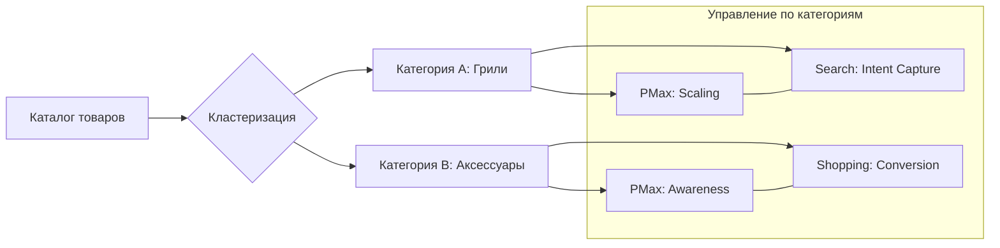

# E-commerce: товары для гриля

## Контекст
Интернет-магазин с четко выраженным товарно-категорийным спросом. Предыдущая структура была чрезмерно обобщенной, что не позволяло эффективно инвестировать в наиболее прибыльные группы товаров (например, угольные грили vs аксессуары).

## Задача
Обеспечить агрессивный рост в приоритетных категориях при сохранении управляемости и эффективности (ROAS) каждой отдельной товарной группы.

## Стратегическая архитектура
Схема реализации категорийного роста через многоканальную воронку:

## Техническая реализация
- **Категорийная декомпозиция**: Сегментировали весь спрос по товарным категориям, что позволило гибко перераспределять бюджет в пользу наиболее востребованных направлений.
- **Масштабирование через Performance Max**: Использовали PMax как основной драйвер роста внутри категорий, обеспечив автоматизированный охват смежной аудитории.
- **Гибридный Search-слой**: Сохранили поисковые кампании как прецизионный инструмент для работы с "горячим" спросом, дополняя ими широкую логику PMax.
- **Структурная реорганизация**: Собрали прозрачную товарную логику внутри аккаунта, исключив внутреннюю конкуренцию между группами объектов.

## Метрики (90 дней)
| Метрика | Значение |
| :--- | :--- |
| **Показы** | 6.1 млн |
| **Клики** | 134 тыс. |
| **Расход** | ~€23.2k |
| **Конверсии** | 1 693 |
| **Value (Выручка)** | ~€157.6k |

> [!NOTE]
> **Инсайт проекта**: Переход от "рекламы магазина" к "рекламе конкретных категорий" позволил увеличить объем продаж без потери контроля над маржинальностью.

## Итог
Внедрение категорийной логики открыло понятные точки роста. Усиление ключевых направлений сделало рекламную структуру не только мощнее, но и значительно устойчивее к колебаниям рынка.
