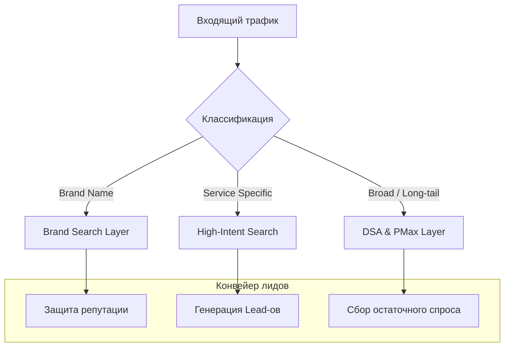

# B2B: логистика

## Контекст
Сложный B2B-проект с длинным циклом принятия решения. Основная проблема — "замусоренность" аккаунта нецелевыми запросами и отсутствие прозрачности в том, какие именно услуги приносят качественные лиды.

## Задача
Стабилизировать поток целевых обращений, очистить воронку от информационного "шума" и сделать структуру спроса абсолютно прозрачной для бизнес-аналитики.

## Стратегическая архитектура
Схема фильтрации и захвата B2B-интента:

## Техническая реализация
- **Изоляция брендового капитала**: Отделили брендовый спрос от общего, что позволило объективно оценить эффективность инвестиций в привлечение новых клиентов.
- **Вертикализация услуг**: Выделили приоритетные логистические направления в отдельные кампании с индивидуальными стратегиями назначения ставок.
- **Фокус на High-Intent**: Перевели Search в режим "максимального захвата" для запросов с высокой коммерческой готовностью.
- **Гибридный охват (DSA + PMax)**: Внедрили динамические поисковые объявления для охвата специфических низкочастотных комбинаций запросов, которые сложно собрать вручную.

## Метрики (90 дней)
| Метрика | Значение |
| :--- | :--- |
| **Показы** | 1.9 млн |
| **Клики** | 45 тыс. |
| **Расход** | ~€10.3k |
| **Конверсии** | 1 090 |

> [!TIP]
> **B2B Инсайт**: В логистике прозрачность структуры важнее объема показов. Разделение интента позволило не просто получать лиды, а понимать их реальную стоимость для каждого направления бизнеса.

## Итог
Проект получил архитектурно правильную структуру, где каждый евро вложений понятен и измерим. Создан фундамент для дальнейшей глубокой оптимизации на основе качества лидов (LTV/CRM данные).
