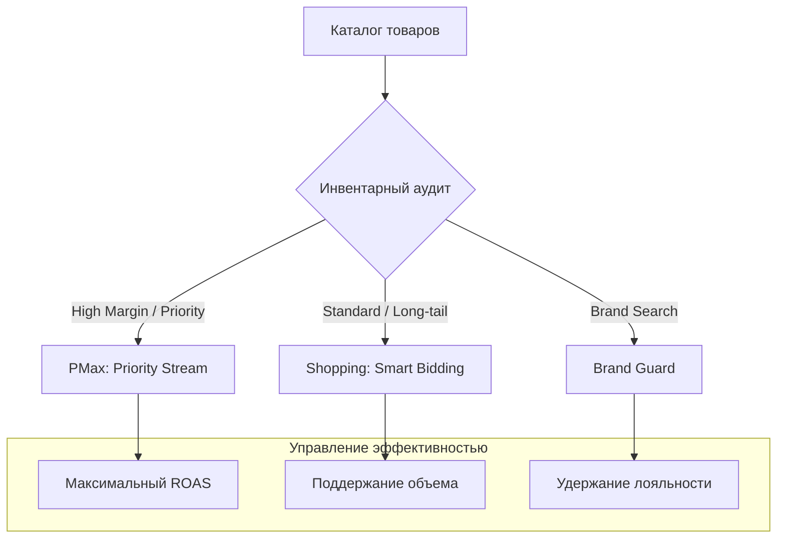

# E-commerce: электротовары

## Контекст
Крупный e-commerce проект с огромным ассортиментом и размытыми приоритетами. Рекламный бюджет распределялся равномерно по всему каталогу, что приводило к недофинансированию прибыльных товаров и лишним тратам на низколиквидные позиции.

## Задача
Внедрить систему приоритетов, где рекламные инвестиции следуют за прибылью бизнеса, и стабилизировать управление performance-каналами.

## Стратегическая архитектура
Логика приоритетного распределения бюджета:

## Техническая реализация
- **Инвентарная приоритизация**: Выделили ключевые товарные группы в отдельные "ударные" кампании, обеспечив им приоритетный доступ к бюджету.
- **Таргетированное масштабирование (PMax)**: Настроили Performance Max для работы по конкретным сегментам аудитории, используя сигналы о прошлых покупках.
- **Эшелонированная защита бренда**: Выделили брендовый поиск в изолированный слой, что предотвратило "раздувание" отчетности PMax за счет органического трафика.
- **Переход к гранулярности**: Ликвидировали "общий поток" на весь каталог, внедрив прозрачную товарную логику по брендам и категориям электроники.

## Метрики (90 дней)
| Метрика | Значение |
| :--- | :--- |
| **Показы** | 4.3 млн |
| **Клики** | 95.6 тыс. |
| **Расход** | ~€7.9k |
| **Конверсии** | 1 178 |
| **Value (Выручка)** | ~€51.6k |

> [!IMPORTANT]
> **Результат трансформации**: Бизнес получил контроль над тем, какие именно товары продаются через рекламу. Это позволило гибко управлять товарными остатками и маржинальностью.

## Итог
Мы создали управляемую performance-структуру, которая отражает реальные приоритеты бизнеса. Это не только улучшило текущие метрики, но и дало четкое понимание, куда инвестировать в следующем квартале.
